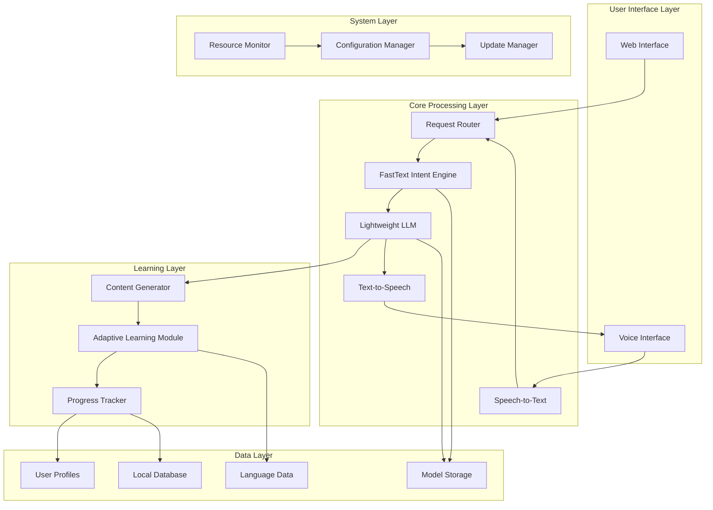

# Design Document: Multilingual Language Learning System

## Overview

The multilingual language learning system is designed as a comprehensive edge-deployable platform that enables language learning for underrepresented languages with limited written resources. The system leverages enhanced FastText for intent classification, a lightweight LLM optimized for edge devices, integrated speech processing, and adaptive learning capabilities, all running efficiently on Raspberry Pi 5 hardware.

The architecture prioritizes offline functionality, resource efficiency, and the unique challenges of working with limited corpus languages where traditional NLP approaches may fail due to lack of written dictionaries or formal language resources.

## Architecture

The system follows a modular, microservices-inspired architecture optimized for edge deployment:



## Components and Interfaces

### Enhanced FastText Intent Engine

**Purpose**: Classify user intents for language learning interactions, optimized for limited corpus languages.

**Key Enhancements**:
- **Subword-level processing**: Utilizes character n-grams to handle morphologically complex and out-of-vocabulary words
- **Cross-lingual embeddings**: Leverages multilingual FastText embeddings to transfer knowledge from high-resource to low-resource languages
- **Incremental learning**: Supports online learning to adapt to new intents without full retraining
- **Phonetic similarity**: Incorporates phonetic features for languages with inconsistent orthography

**Interface**:
```python
class FastTextIntentEngine:
    def classify_intent(self, text: str, language: str) -> IntentResult
    def add_training_example(self, text: str, intent: str, language: str) -> bool
    def update_model_incremental(self, examples: List[TrainingExample]) -> bool
    def get_confidence_score(self, text: str, intent: str) -> float
```

**Performance Targets**:
- Classification latency: <100ms on Raspberry Pi 5
- Memory usage: <512MB
- Accuracy: >85% for languages with >1000 examples, >75% for limited data

### Lightweight LLM Module

**Purpose**: Provide natural language understanding and generation capabilities optimized for edge deployment.

**Architecture Approach**:
- **Model Selection**: Based on research, SmolLM2 or similar 1.5B-3B parameter models optimized for edge devices
- **Quantization**: INT8 quantization to reduce memory footprint while maintaining quality
- **Knowledge Distillation**: Compressed from larger multilingual models to retain language capabilities
- **Efficient Attention**: Optimized attention mechanisms for reduced computational overhead

**Interface**:
```python
class LightweightLLM:
    def generate_response(self, prompt: str, language: str, max_tokens: int) -> str
    def generate_learning_content(self, topic: str, difficulty: str, language: str) -> LearningContent
    def translate_text(self, text: str, source_lang: str, target_lang: str) -> str
    def evaluate_user_response(self, expected: str, actual: str, language: str) -> EvaluationResult
```

**Resource Constraints**:
- RAM usage: <3.5GB (leaving 512MB for system)
- Storage: <6GB for model files
- Inference time: <2 seconds for typical responses
- Supports 5+ simultaneous language pairs

### Speech Processing Module

**STT Component**:
- **Model**: Whisper-tiny or similar lightweight ASR model with multilingual support
- **Adaptation**: Fine-tuned on available audio data for target languages
- **Noise Handling**: Robust to background noise up to 40dB
- **Streaming**: Real-time processing for interactive learning

**TTS Component**:
- **Synthesis**: FastSpeech2 or similar lightweight neural TTS
- **Voice Cloning**: Few-shot voice adaptation for limited corpus languages
- **Prosody**: Natural intonation and rhythm generation
- **Multilingual**: Support for phoneme-based synthesis across language families

**Interface**:
```python
class SpeechProcessor:
    def speech_to_text(self, audio: AudioData, language: str) -> STTResult
    def text_to_speech(self, text: str, language: str, voice_id: str) -> AudioData
    def detect_language(self, audio: AudioData) -> LanguageDetectionResult
    def assess_pronunciation(self, reference: str, spoken: AudioData) -> PronunciationScore
```

### Adaptive Learning Module

**Learning Path Engine**:
- **Spaced Repetition**: Implements modified Anki algorithm for optimal review scheduling
- **Difficulty Adjustment**: Dynamic content difficulty based on user performance
- **Multimodal Learning**: Combines text, audio, and visual learning modalities
- **Cultural Context**: Incorporates cultural and contextual learning for authentic language use

**Progress Tracking**:
- **Competency Mapping**: Tracks skills across listening, speaking, reading, writing
- **Learning Analytics**: Identifies learning patterns and optimization opportunities
- **Federated Learning**: Anonymized learning improvements shared across devices

**Interface**:
```python
class AdaptiveLearning:
    def generate_lesson(self, user_id: str, language_pair: LanguagePair) -> Lesson
    def update_progress(self, user_id: str, lesson_result: LessonResult) -> None
    def recommend_content(self, user_id: str, learning_goals: List[str]) -> List[Content]
    def assess_proficiency(self, user_id: str, language: str) -> ProficiencyLevel
```

## Data Models

### Core Data Structures

```python
@dataclass
class LanguagePair:
    source_language: str
    target_language: str
    proficiency_level: str
    learning_goals: List[str]

@dataclass
class IntentResult:
    intent: str
    confidence: float
    language: str
    entities: Dict[str, Any]

@dataclass
class LearningContent:
    content_id: str
    content_type: str  # vocabulary, grammar, conversation, pronunciation
    difficulty_level: int
    source_text: str
    target_text: str
    audio_data: Optional[bytes]
    metadata: Dict[str, Any]

@dataclass
class UserProfile:
    user_id: str
    native_language: str
    target_languages: List[str]
    learning_preferences: Dict[str, Any]
    progress_data: Dict[str, ProgressMetrics]
    device_capabilities: DeviceSpecs

@dataclass
class LimitedCorpusLanguage:
    language_code: str
    language_name: str
    script_type: str
    phonetic_system: str
    available_resources: List[str]
    corpus_size: int
    audio_hours: float
```

### Database Schema

**Local SQLite Database**:
- **Users**: User profiles and preferences
- **Progress**: Learning progress and analytics
- **Content**: Cached learning materials
- **Languages**: Language metadata and resources
- **Sessions**: Learning session history
- **Models**: Model versions and performance metrics

**File Storage Structure**:
```
/data/
├── models/
│   ├── fasttext/
│   ├── llm/
│   ├── stt/
│   └── tts/
├── languages/
│   ├── {lang_code}/
│   │   ├── audio/
│   │   ├── text/
│   │   └── phonetic/
└── users/
    └── {user_id}/
        ├── profile.json
        ├── progress.db
        └── preferences.json
```

## Correctness Properties

*A property is a characteristic or behavior that should hold true across all valid executions of a system—essentially, a formal statement about what the system should do. Properties serve as the bridge between human-readable specifications and machine-verifiable correctness guarantees.*

Based on the requirements analysis, the following properties ensure system correctness across all operational scenarios:

### Property 1: Intent Classification Accuracy
*For any* text input in a supported Limited_Corpus_Language, the FastText_Engine should classify learning intents with accuracy above the minimum threshold (85% for well-resourced intents, 75% for limited data scenarios)
**Validates: Requirements 1.1, 1.2**

### Property 2: Incremental Learning Preservation
*For any* existing trained FastText model, adding new intent categories through incremental learning should maintain or improve accuracy on existing intents while successfully learning new ones
**Validates: Requirements 1.3**

### Property 3: Multilingual Input Handling
*For any* input containing multiple languages, the FastText_Engine should correctly identify the primary language and classify intent based on that language's model
**Validates: Requirements 1.5**

### Property 4: System Performance Bounds
*For any* user request (intent classification, LLM generation, TTS synthesis, UI interaction), the system should respond within the specified time limits on target edge hardware
**Validates: Requirements 1.4, 2.2, 3.4, 7.2**

### Property 5: Resource Constraint Compliance
*For any* system operation, memory usage should remain within 4GB RAM limits and total installation should not exceed 8GB storage on edge devices
**Validates: Requirements 2.1, 2.4**

### Property 6: Multilingual Language Support
*For any* set of at least 5 Limited_Corpus_Languages, the Lightweight_LLM should successfully generate appropriate responses for basic language learning tasks in each language
**Validates: Requirements 2.3**

### Property 7: Speech Recognition Robustness
*For any* audio input with background noise up to 40dB, the STT_Module should either achieve 80%+ transcription accuracy or request clarification rather than provide incorrect output
**Validates: Requirements 3.1, 3.3, 3.5**

### Property 8: Adaptive Learning Behavior
*For any* user learning session, when performance indicates proficiency the system should increase difficulty, and when performance indicates struggle the system should provide additional practice
**Validates: Requirements 4.2, 4.3**

### Property 9: Progress Tracking Consistency
*For any* user engaging with multiple Language_Pairs, progress data should be accurately tracked and persisted locally for each language pair independently
**Validates: Requirements 4.1, 4.5**

### Property 10: Concurrent Session Handling
*For any* scenario with up to 5 simultaneous user sessions, the system should maintain stable performance and resource allocation without degradation
**Validates: Requirements 5.4**

### Property 11: Offline Functionality Completeness
*For any* core language learning feature, the system should operate fully without internet connectivity using only locally stored models and data
**Validates: Requirements 5.5**

### Property 12: Limited Corpus Language Adaptation
*For any* Limited_Corpus_Language with minimal written resources, the system should prioritize audio-first learning approaches and utilize phonetic representations when text is unavailable
**Validates: Requirements 6.1, 6.3**

### Property 13: Local Model Evolution
*For any* user interaction that provides new language data, the system should update local language models while maintaining user privacy through local-only storage
**Validates: Requirements 6.2, 6.5**

### Property 14: Responsive Interface Adaptation
*For any* device screen size or orientation, the interface should adapt appropriately while maintaining usability and providing consistent feedback for all interaction types
**Validates: Requirements 7.1, 7.3, 7.4, 7.5**

### Property 15: System Monitoring and Recovery
*For any* system operation, performance metrics and errors should be logged locally, and the system should provide diagnostic capabilities and backup/recovery functionality
**Validates: Requirements 8.1, 8.3, 8.5**

### Property 16: Adaptive Resource Management
*For any* resource constraint scenario, the system should automatically adjust allocation to prioritize core learning functions and support seamless updates without service interruption
**Validates: Requirements 5.2, 8.2, 8.4**

## Error Handling

### Speech Processing Errors
- **Audio Quality Issues**: When STT confidence is below threshold, request user to repeat or speak more clearly
- **Language Detection Failures**: Fall back to user's default language setting or prompt for language selection
- **TTS Generation Errors**: Provide text-only fallback when speech synthesis fails

### Model Performance Degradation
- **Memory Pressure**: Automatically reduce model precision or switch to smaller model variants
- **Processing Timeouts**: Implement graceful degradation with simplified responses
- **Storage Limitations**: Prioritize essential models and compress or remove less-used language data

### Network and Connectivity
- **Offline Operation**: All core functions must work without internet connectivity
- **Update Failures**: Maintain rollback capability to previous working system state
- **Federated Learning Sync**: Queue updates for later transmission when connectivity is restored

### User Input Errors
- **Invalid Language Combinations**: Provide clear feedback and suggest valid alternatives
- **Malformed Requests**: Parse intent from partial or unclear input using context
- **Hardware Limitations**: Adapt interface complexity based on device capabilities

## Testing Strategy

### Dual Testing Approach

The system requires both unit testing and property-based testing to ensure comprehensive coverage:

**Unit Tests** focus on:
- Specific examples of intent classification for known language patterns
- Edge cases in speech processing (silence, very short utterances, extreme noise)
- Integration points between components (STT→Intent→LLM→TTS pipeline)
- Error conditions and recovery mechanisms
- Hardware-specific deployment scenarios

**Property-Based Tests** focus on:
- Universal properties that hold across all supported languages and inputs
- Performance characteristics under varying load conditions
- Resource usage patterns across different operational scenarios
- Adaptive learning behavior across diverse user interaction patterns

### Property-Based Testing Configuration

**Framework Selection**: 
- Python: Use Hypothesis for property-based testing
- JavaScript/TypeScript: Use fast-check for property-based testing
- Each property test must run minimum 100 iterations due to randomization

**Test Tagging**: Each property-based test must include a comment referencing the design document property:
```python
# Feature: multilingual-language-learning, Property 1: Intent Classification Accuracy
```

**Coverage Requirements**:
- Each correctness property must be implemented by exactly one property-based test
- Property tests should generate diverse inputs covering edge cases automatically
- Unit tests should complement property tests by testing specific known scenarios

### Edge Device Testing

**Hardware Validation**:
- All tests must pass on actual Raspberry Pi 5 hardware
- Performance tests must account for thermal throttling and power constraints
- Memory and storage tests must validate real-world resource usage

**Deployment Testing**:
- Automated installation testing on fresh Raspberry Pi OS images
- Network isolation testing to verify offline functionality
- Multi-user concurrent access testing with resource monitoring

### Language-Specific Testing

**Limited Corpus Language Validation**:
- Test with actual low-resource languages (not just simulated limited data)
- Validate phonetic representation accuracy for languages without standard orthography
- Test cross-lingual transfer learning effectiveness

**Audio Quality Testing**:
- Test STT/TTS with various audio quality levels and background noise
- Validate pronunciation assessment accuracy across different accents
- Test voice cloning capability with minimal training data